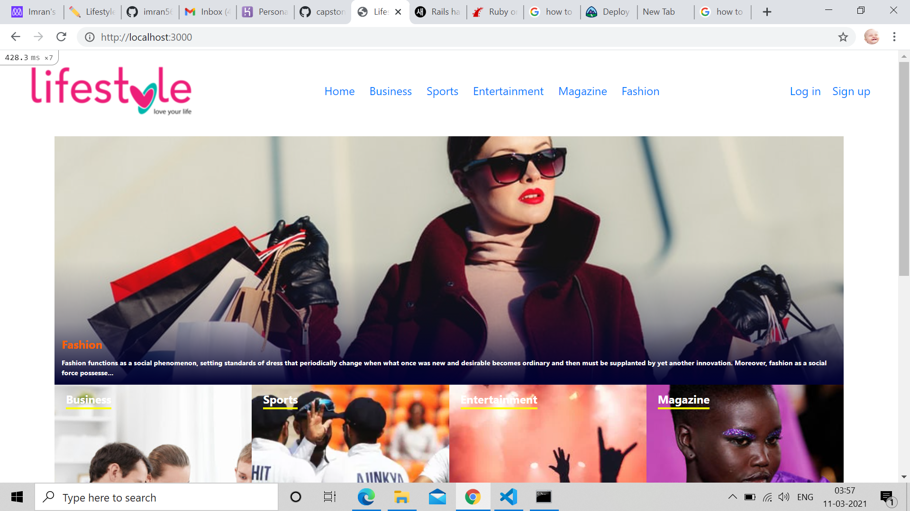

# Rails Capstone - Lifestyle articles

This project was presented as final project for the Rails Curriculum. It is a Lifestyle Article where people can apply filters by category and vote on their preferred articles.
People can create their own articles and they have a page that suggests articles based on their votes.

Built with Ruby on Rails framework 



## Built With

- Ruby v2.7.0
- Ruby on Rails v5.2.4


## Live Demo

[Lifestyle articles](https://quiet-refuge-35992.herokuapp.com/)


## Getting Started

To get a local copy up and running follow these simple example steps.

## Clone the repository

```
   git clone https://github.com/imran5644/lifestyle-capstone.git
   cd lifestyle-capstone
```

### Prerequisites

Ruby: 2.6.3
Rails: 5.2.3

### In Case Of Windows run this command
bundle exec rake webpacker:install


### Setup

Install gems with:

```
   bundle install
```

### Install yarn

Add yarn install --check-files


Setup database with:

```
   rails db:create
   rails db:migrate
   rails db:seed
```

### Usage

Start server with:

```
    rails server
```

Open `http://localhost:3000/` in your browser.

### Run tests

```
    rpsec --format documentation
```


### Deployment

In order to deploy this app to Heroku follow the steps below

Install the Heroku CLI available [here](https://devcenter.heroku.com/articles/heroku-cli)

After that type the command to create the app and add the heroku repository to your project

```
    heroku create
```

Then deploy the app.

```
    git push -u heroku {you-branch}:master
```
    
Change {your-branch} for the name of your local branch

Follow the instructions on your terminal to get the URL where your app was deployed


Finally run the command to create your database and tables on Heroku's server

```
    heroku run rails db:migrate
    heroku run rails db:seed
``` 

👤 **Imran Yousaf**

- GitHub: [@imran5644](https://github.com/imran5644/)
- Twitter: [@imran56444](https://twitter.com/imran56444)
- LinkedIn: [Imran yousaf](https://www.linkedin.com/in/imran-yousaf5644/)

## Acknowledments
- Nelson Sakwa
- All websites where I found images and text for the articles
- Font Awesome
- W3schools
- Twitter Boostrap

## 🤝 Contributing

Contributions, issues and feature requests are welcome!

## Show your support

Give a ⭐️ if you like this project!!
